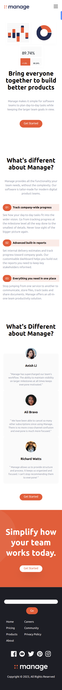

# Landing Page With TailwindCSS

## Desktop View


## Mobile View



## Built With

- HTML
- CSS
- Tailwind CSS
- JavaScript


## Getting Started

To get a local copy up and running follow these simple example steps.

Clone the repo with `git clone https://github.com/HENRYKC24/Landing-Page-with-TailwindCSS.git`


## Get a local copy of the project
```
git clone https://github.com/HENRYKC24/Landing-Page-with-TailwindCSS.git
```
## Navigate to the project directory
```
cd Landing-Page-with-TailwindCSS
```
## Build the project
```
npm run build
```

### hot-reloads for development
```
npm run watch
```

### Display the project in the browser
Open `index.html` in the browser


That's it!


## Author

👤 **Henry Kc**

- GitHub: [@githubhandle](https://github.com/henrykc24)
- Twitter: [@twitterhandle](https://twitter.com/henrykc24)
- LinkedIn: [LinkedIn](https://linkedin.com/in/henry-kc)


## 🤝 Contributing

Contributions, issues, and feature requests are welcome!

Feel free to check the [issues page](https://github.com/HENRYKC24/Landing-Page-with-TailwindCSS/issues/).

## Show your support

Give a ⭐️ if you like this project!

## Acknowledgments

- A special thanks goes to Traversy Media for guiding me in this project.
- Thanks to every author whose code contributed to this project.

## 📝 License

This project is [MIT](./LICENSE) licensed.


